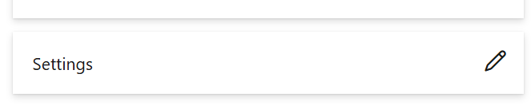
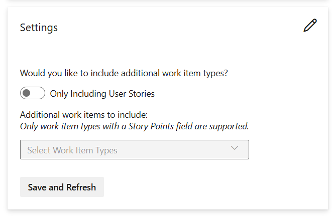
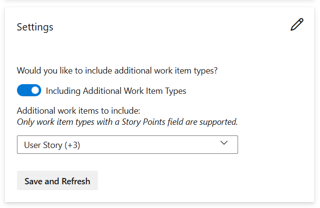

Enhanced Sprint History supports viewing changes to user stories, or optionally other supported work items, in an iteration over time.

It features:
1. Three charts showing the sprint state.
2. The history of work item changes on the sprint.
3. A listing of all items that are or were in the sprint.
4. The ability to add other work item types.
	- Additional work item types must have the built-in **Story Points** field.

Users can select the team and iteration they want to view information for:

Chart of daily changes during the sprint:

Chart of all changes by day:

Chart of all changes:

List of all story point changes that impact the sprint:

List of all work items that are/were in the sprint:

## Settings
By default reporting is limited to User Stories. Additional work items can be selected in the Settings section. These settings are shared by all users, within the project.

Default:

Once enabled you can select one or more work items to include:

Work items must include the built-in **Story Points** field to be available for selection.

## Support and Enhancement Requests
Support and enhancement requests can be made via the Support link (GitHub).
