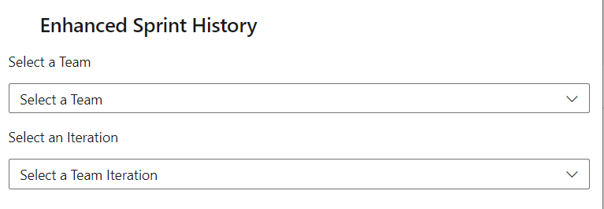
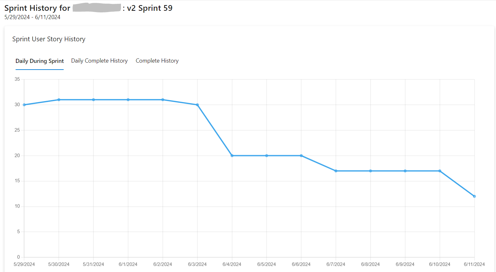
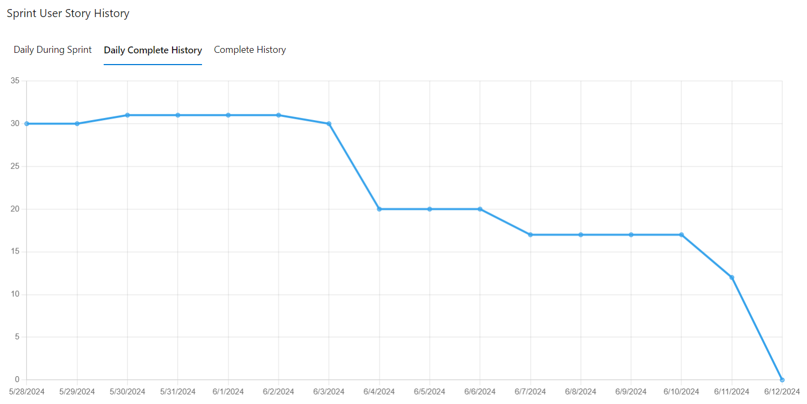
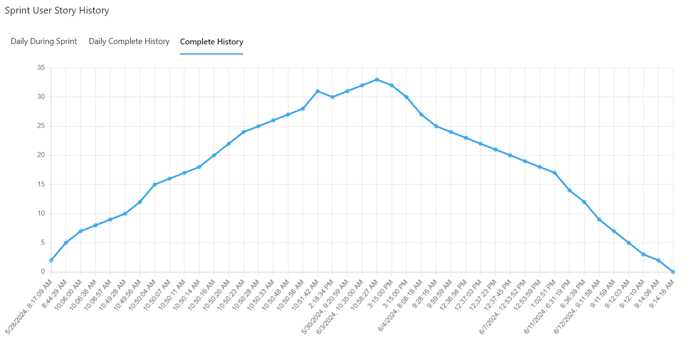
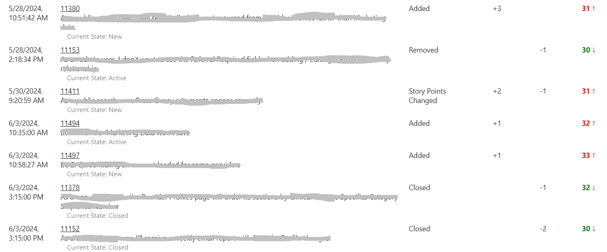
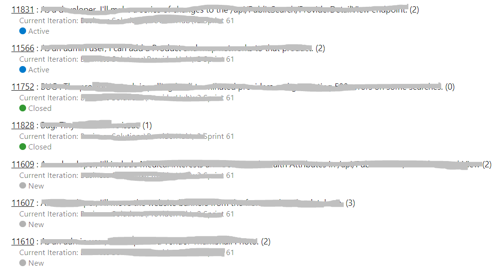

Enhanced Sprint History supports viewing changes to user stories in an iteration over time.

It features:
1. Three charts showing the sprint state.
2. The history of user story changes on the sprint.
3. A listing of all user stories that are or were in the sprint.

Users can select the team and iteration they want to view information for:

Chart of daily changes during the sprint:

Chart of all changes by day:

Chart of all changes:

List of all user story changes that impact the sprint:

List of all user stories that are/were in the sprint:

